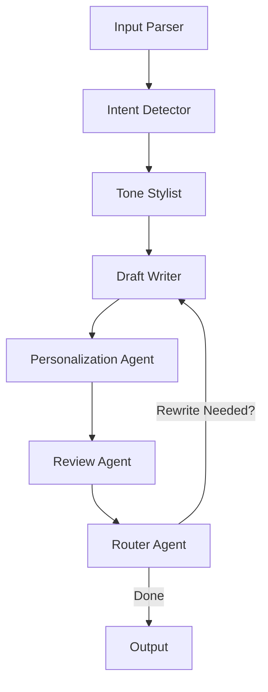

# Agentic AI Email Generator

## 1. Introduction

The Agentic AI Email Generator is a smart assistant designed to help professionals quickly draft, personalize, and review emails. Leveraging a multi-agent workflow and advanced language models, it produces high-quality, context-aware email drafts tailored to your needs in seconds.

---

## 2. Features

- **Rapid Email Drafting:** Compose emails in under 2 minutes.
- **Context Awareness:** Adapts content and tone based on your input and recipient.
- **Multiple Tones:** Choose from formal, casual, or assertive styles.
- **Versatile Use Cases:** Supports outreach, follow-ups, internal updates, and more.
- **Personalization & Memory:** Remembers your preferences and previous drafts.
- **Voice Input:** Dictate your intent for hands-free drafting.
- **Grammar & Tone Review:** Built-in review agent for clarity and correctness.

---

## 3. How It Works

The app uses a modular, multi-agent system to process your input and generate polished emails:

1. **Input Parser:** Extracts intent, recipient, tone, and constraints from your prompt.
2. **Intent Detector:** Classifies your email (outreach, follow-up, apology, etc.).
3. **Tone Stylist:** Adjusts language style to your selected tone.
4. **Draft Writer:** Generates the main email body.
5. **Personalization Agent:** Inserts your name, signature, and context.
6. **Review Agent:** Checks grammar, tone, and coherence.
7. **Router Agent:** Handles fallback logic and memory updates.

---

## 4. Usage

1. Launch the app (locally or on Streamlit Cloud).
2. Select your desired **email tone** (formal, casual, assertive).
3. Enter or speak your **email intent**.
4. Preview, edit, and export your personalized draft.
5. Optionally, save drafts to your profile history.

---

## 5. Agent Flow

The core of the app is a multi-agent pipeline, where each agent performs a specialized task and passes the result to the next. The flow is as follows:



**Description:**

- **Input Parser:** Extracts structured info from user input.
- **Intent Detector:** Classifies the type of email.
- **Tone Stylist:** Sets the tone and style.
- **Draft Writer:** Generates the draft content.
- **Personalization Agent:** Adds user-specific details.
- **Review Agent:** Checks for grammar, tone, and clarity.
- **Router Agent:** Decides if another draft/rewrite is needed or finishes the flow.

---

## 6. Architecture

The application is organized as follows:

```text
Email-Generator/
├── streamlit_app.py               # Streamlit Cloud entrypoint (thin UI bootstrap)
├── requirements.txt               # Python dependencies
├── README.md                      # Architecture, setup, and usage details
│
├── src/
│   ├── ui/
│   │   └── streamlit_app.py       # UI components, forms, preview, export
│   ├── agents/
│   │   ├── draft_writer_agent.py
│   │   ├── input_parser_agent.py
│   │   ├── intent_decision_agent.py
│   │   ├── personalization_agent.py
│   │   ├── review_agent.py
│   │   ├── router_agent.py
│   │   └── tone_stylist_agent.py
│   ├── example_voice_inputs/
│   │   ├── assertive.m4a
│   │   ├── friendly.m4a
│   │   └── professional.m4a
│   ├── workflow/
│   │   └── langgraph_flow.py      # LangGraph StateGraph orchestration
│   ├── memory/
│   │   ├── __init__.py
│   │   ├── json_memory.py
│   │   └── user_profiles.json
│   ├── integrations/
│   │   └── llm_client.py          # OpenAI LLM
│   └── runtime.txt                # Python version
├── data/
│   └── tone_samples.json
```

---

## 7. Prompt Logic

The app uses a structured prompt logic to extract and transform user input into a high-quality email draft. Here’s how the prompt flows through the system:

1. **User Input:**

   - The user provides a text or voice prompt describing the email’s intent, recipient, tone, and any constraints (e.g., "to: Alice\nFollow-up on meeting... tone: formal").

2. **Parsing:**

   - The Input Parser agent uses regular expressions and heuristics to extract fields such as recipient name, tone, and constraints from the raw prompt.

3. **Intent Detection:**

   - The Intent Detector agent classifies the email type (e.g., outreach, follow-up, apology) using a language model and a system prompt that restricts output to a set of known intents.

4. **Prompt Construction for LLM:**

   - The Draft Writer agent assembles a structured prompt for the LLM, including:
     - User’s original prompt
     - Detected intent
     - Tone instructions (from the Tone Stylist agent)
     - Sender and recipient details
     - Any constraints (e.g., length, style)
   - Example system prompt:
     ```text
     User Prompt: {prompt}
     Intent: {intent}
     Tone Instructions: {tone_instructions}
     Sender Profile: name: {sender_name}, company: {profile_company}
     Recipient: {recipient}
     Constraints: {constraints}
     Return a JSON object exactly with fields: subject, body.
     ```

5. **Personalization and Review:**

   - The generated draft is further personalized (e.g., inserting sender name, signature) and reviewed for grammar, tone, and clarity.

6. **Output:**
   - The final draft is presented to the user for editing, export, or saving to history.

---

## Example Voice Intents

Sample voice input files are available in `src/example_voice_inputs/`.

---

## Deployment

**Streamlit Cloud:** https://appapppy-tp7ghummmwsicrrwbvraws.streamlit.app
