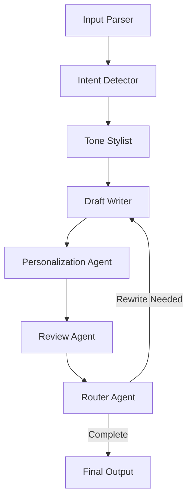

# Agentic AI Email Generator


---

## Table of Contents

1. [Introduction](#introduction)
2. [Features](#features)
3. [How It Works](#how-it-works)
4. [Agent Flow](#agent-flow)
5. [Architecture](#architecture)
6. [Prompt Logic](#prompt-logic)
7. [Usage](#usage)
8. [Requirements](#requirements)
9. [Installation & Setup](#installation--setup)
10. [Live Agent Tracing](#live-agent-tracing)
11. [Voice Input Support](#voice-input-support)
12. [Example Voice Inputs](#example-voice-inputs)
13. [Deployment](#deployment)

---

## Introduction

**Agentic AI Email Generator** is a multi-agent, AI-powered email assistant built to help professionals draft, personalize, and review emails with speed and accuracy.

Using **LangGraph** for orchestration and **OpenAI LLMs**, the system breaks email creation into specialized agents, producing high-quality, context-aware emails while maintaining transparency through live execution traces.

---

## Features

- 🚀 Rapid email drafting in under 2 minutes
- 🎯 Automatic intent detection (follow-up, outreach, apology, etc.)
- 🎨 Multiple tones: formal, casual, assertive, or profile-based
- 🧠 Memory-based personalization
- 🎙 Voice input with speech-to-text
- 🧪 Grammar, tone, and clarity review
- 🧭 Live per-agent execution tracing
- ✏ Editable drafts with export support
- 💾 Save drafts to profile history

---

## How It Works

The system uses a **LangGraph StateGraph** where each agent performs a single, well-defined task.  
Structured outputs are passed downstream until a final, polished email is produced.

---

## Agent Flow



**Description:**

- **Input Parser:** Extracts structured info from user input.
- **Intent Detector:** Classifies the type of email.
- **Tone Stylist:** Sets the tone and style.
- **Draft Writer:** Generates the draft content.
- **Personalization Agent:** Adds user-specific details.
- **Review Agent:** Checks for grammar, tone, and clarity.
- **Router Agent:** Decides if another draft/rewrite is needed or finishes the flow.

---

## Architecture

The application is organized as follows:

```text
Email-Generator/
├── streamlit_app.py               # Streamlit Cloud entrypoint (thin UI bootstrap)
├── requirements.txt               # Python dependencies
├── README.md                      # Architecture, setup, and usage details
│
├── src/
│   ├── ui/
│   │   └── streamlit_app.py       # UI components, forms, preview, export
│   ├── agents/
│   │   ├── draft_writer_agent.py
│   │   ├── input_parser_agent.py
│   │   ├── intent_decision_agent.py
│   │   ├── personalization_agent.py
│   │   ├── review_agent.py
│   │   ├── router_agent.py
│   │   └── tone_stylist_agent.py
│   ├── example_voice_inputs/
│   │   ├── assertive.m4a
│   │   ├── friendly.m4a
│   │   └── professional.m4a
│   ├── workflow/
│   │   └── langgraph_flow.py      # LangGraph StateGraph orchestration
│   ├── memory/
│   │   ├── __init__.py
│   │   ├── json_memory.py
│   │   └── user_profiles.json
│   ├── integrations/
│   │   └── llm_client.py          # OpenAI LLM
│   └── runtime.txt                # Python version
├── data/
│   └── tone_samples.json
```

---

## Prompt Logic

The app uses a structured prompt logic to extract and transform user input into a high-quality email draft. Here’s how the prompt flows through the system:

1. **User Input:**

   - The user provides a text or voice prompt describing the email’s intent, recipient, tone, and any constraints (e.g., "to: Alice\nFollow-up on meeting... tone: formal").

2. **Parsing:**

   - The Input Parser agent uses regular expressions and heuristics to extract fields such as recipient name, tone, and constraints from the raw prompt.

3. **Intent Detection:**

   - The Intent Detector agent classifies the email type (e.g., outreach, follow-up, apology) using a language model and a system prompt that restricts output to a set of known intents.

4. **Prompt Construction for LLM:**

   - The Draft Writer agent assembles a structured prompt for the LLM, including:
     - User’s original prompt
     - Detected intent
     - Tone instructions (from the Tone Stylist agent)
     - Sender and recipient details
     - Any constraints (e.g., length, style)
   - Example system prompt:
     ```text
     User Prompt: {prompt}
     Intent: {intent}
     Tone Instructions: {tone_instructions}
     Sender Profile: name: {sender_name}, company: {profile_company}
     Recipient: {recipient}
     Constraints: {constraints}
     Return a JSON object exactly with fields: subject, body.
     ```

5. **Personalization and Review:**

   - The generated draft is further personalized (e.g., inserting sender name, signature) and reviewed for grammar, tone, and clarity.

6. **Output:**
   - The final draft is presented to the user for editing, export, or saving to history.

---

## Usage

    1.	Launch the app
    2.	Choose Text or Voice input
    3.	Select a tone (or use profile default)
    4.	Generate the email
    5.	Review agent traces
    6.	Edit, export, or save the draft

## Requirements

    •	Python 3.10+
    •	Streamlit
    •	LangGraph
    •	OpenAI API key

## Installation & Setup

- git clone https://github.com/your-repo/agentic-email-generator.git
- cd agentic-email-generator
- pip install -r requirements.txt

  **Set environment variable:**

- export OPENAI_API_KEY="your_api_key"

**Run Locally**

- streamlit run streamlit_app.py

## Live Agent Tracing

**The UI displays real-time traces for each agent, including:**
• Agent name
• Execution duration
• Timestamp
• Input and output keys

This provides transparency and simplifies debugging.

## Example Voice Intents

Sample voice input files are available in `src/example_voice_inputs/`.

## Deployment

**Streamlit Cloud:** https://appapppy-tp7ghummmwsicrrwbvraws.streamlit.app
